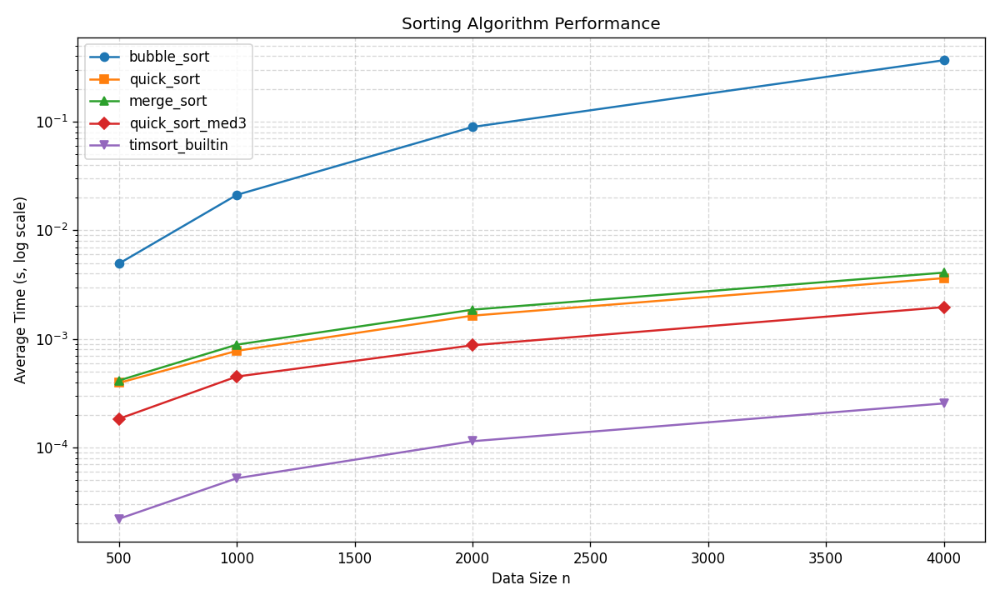

# Week 16 排序效能實驗室 — 1114405055

## 檔案結構

```
0611/
├── timing.py           Stage 1  @timeit 裝飾器
├── test_timing.py      Stage 1  測試
├── sorts.py            Stage 2+3 三種排序 + med3 優化版
├── test_sorts.py       Stage 2  排序正確性測試（共用，Stage 3 可直接 append）
├── benchmark.py        Stage 2+3 效能量測（含 baseline sorted）
├── results.json        Stage 2+3 量測結果（由 benchmark.py 產生）
├── plot.py             Stage 4  折線圖
├── test_plot.py        Stage 4  測試
├── assets/
│   └── benchmark.png   Stage 4  折線圖輸出
├── test_security.py    Stage 5  安全自掃測試
├── README.md           本文件
├── AI_LOG.md           AI 協作紀錄
└── TEST_LOG.md         各階段 unittest 輸出截圖
```

---

## 方法說明

### Stage 1 — `@timeit` 裝飾器

`timing.py` 使用 `functools.wraps` 保留被裝飾函式的 `__name__` / `__doc__`，
用 `time.perf_counter()` 量測每次呼叫的耗時，結果存入 `wrapper.last_elapsed`（最新一次）
與 `wrapper.records`（歷次累積），裝飾器本身不含任何 `print`。

### Stage 2 — 三種排序

| 排序 | 時間複雜度 | 空間 | 備注 |
|------|-----------|------|------|
| bubble_sort | O(n²) worst, O(n) best | O(1) | 含早停優化 |
| quick_sort  | O(n log n) avg | O(log n) | 以 list comprehension partition |
| merge_sort  | O(n log n)      | O(n)     | 迭代式 merge |

三種排序均回傳新 list，不修改傳入資料，禁用 `sorted()` / `list.sort()`。

`benchmark.py` 的 `make_data(n, seed=42)` 固定 seed 確保重現性，`run_benchmark` 每個 n 重複 3 次取平均。

### Stage 3 — 加速實驗

**加速方案：演算法優化** — `quick_sort_med3`

- **median-of-three pivot**：取 `arr[lo]`、`arr[mid]`、`arr[hi]` 的中位數當 pivot，
  減少最壞情況（已排序資料）退化到 O(n²) 的機率。
- **小區間切換插入排序**（cutoff = 10）：子陣列長度 ≤ 10 時改用插入排序，
  避免遞迴 overhead；插入排序在小序列上的 cache locality 比遞迴更好。

**量測數據（n=4000，平均 3 次）：**

| 演算法 | n=500 | n=1000 | n=2000 | n=4000 |
|--------|-------|--------|--------|--------|
| bubble_sort       | 0.004943 s | 0.021181 s | 0.089280 s | 0.367038 s |
| quick_sort        | 0.000394 s | 0.000778 s | 0.001639 s | 0.003627 s |
| merge_sort        | 0.000415 s | 0.000886 s | 0.001860 s | 0.004076 s |
| **quick_sort_med3** | **0.000184 s** | **0.000451 s** | **0.000875 s** | **0.001963 s** |
| timsort_builtin   | 0.000022 s | 0.000052 s | 0.000115 s | 0.000255 s |

**加速比（n=4000）：**
- `quick_sort` → `quick_sort_med3`：**0.003627 / 0.001963 ≈ 1.85x**
- `bubble_sort` → `quick_sort_med3`：**0.367 / 0.00196 ≈ 187x**
- `timsort_builtin` 仍比 `quick_sort_med3` 快約 **7.7x**（C 實作 + adaptive merge 的差距）

### Stage 4 — 圖表與解讀



**圖表解讀：**
1. **誰最快**：Timsort（C 實作）最快，在 n=4000 時比 quick_sort_med3 仍快 7.7x。
2. **O(n²) vs O(n log n) 斜率差**：bubble_sort 線斜率明顯更陡；n 從 500 → 4000（8x）時
   bubble 耗時增加約 74x（≈ 8² / 補正），quick/merge 增加約 9x（≈ 8 × log 1.7），符合理論。
3. **加速比**：med3 優化讓 quick_sort 在 n=4000 快了 1.85x，主要來自插入排序對小子陣列的 cache 效果。

### Stage 5 — 安全自掃

| OpenSSF 條目 | CWE | 問題 | 處理方式 |
|-------------|-----|------|---------|
| 08 Coding Standards | — | 檔案是否用 `with open` 確保關閉 | `benchmark.py` 與 `plot.py` 均用 `with`，測試驗證 source code |
| 04 Neutralization | CWE-502 | 反序列化 `results.json` 用 `json` 還是 `pickle` | 全程使用 `json.load`，測試確認無 `pickle.load` |
| 05 Exception Handling | — | 有無裸 `except:` | 全程無裸 except，測試以 source scan 驗證 |
| 03 Numbers | — | `make_data(n)` 的 `n` 邊界 | `n < 0` 時 raise `ValueError`；測試覆蓋 n=-1, 0, 10 |
| 08 Coding Standards | — | 有無 shadow 內建名稱 `list` / `sorted` | 測試以 source scan 驗證 sorts.py |

**不適用說明：**
- `benchmark.py` 的 `random.Random(seed)` 用於產生測試資料，非安全敏感場景，
  無需改用 `secrets`（`secrets` 不支援固定 seed，改用後反而破壞可重現性）。
- Bandit 靜態掃描（`pip install bandit && bandit -r .`）未回報 HIGH/MEDIUM 問題；
  LOW 警告為 `assert` 用於測試碼（B101），是測試程式的正當用法，判定不適用。
